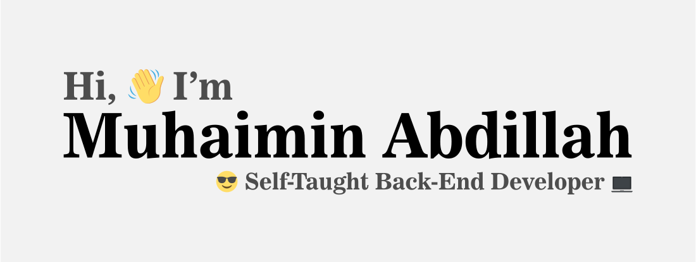

- 🔭 I’m currently working on [Coursify: REST API written in Go](https://github.com/muhaimin-a8/coursify)
- 🌱 I’m currently learning Go
- 👯 I’m looking to collaborate on ...
- 🤔 I’m looking for help with ...
- 💬 Ask me about backend, software architecture, etc.
- 📫 How to reach me: contact me on my social media
- 😄 Pronouns: he/him
- ⚡ Fun fact: 
  - I'm a fast learner.

## About me

## Connect with me

## Languages and Tools

## Courses and Bootcamps Journey
- [IDCAMP](https://idcamp.ioh.co.id/) 2023 x [Dicoding Indonesia](https://www.dicoding.com/) `on going` : [Android Developer Intermediate](https://www.dicoding.com/learningpaths/7)
- [IDCAMP](https://idcamp.ioh.co.id/) 2022 x [Dicoding Indonesia](https://www.dicoding.com/) `Graduate` : [BackEnd Developer Expert](https://www.dicoding.com/learningpaths/41)

## Experiences
- Project-Based Virtual Intern : [Fullstack Developer](https://www.rakamin.com/virtual-internship-experience/fullstack-development-btpn-syariah) [BTPN Syariah](https://www.btpnsyariah.com/) x [Rakamin Academy](https://www.rakamin.com/) Batch September 2023

## Best Personal Projects
- [Coursify](https://github.com/muhaimin-a8/coursify) : `REST API` written in `Go`
- [Forum API](https://github.com/muhaimin-a8/dicoding-submission-forum-api) : `REST API` written in `JavaScript` with [Hapi Frameworks](https://hapi.dev) as final submission task for [BackEnd Developer Expert](https://www.dicoding.com/academies/276) course at [Dicoding Indonesia](https://dicoding.com/). [<i>See certificate</i>](https://www.dicoding.com/certificates/N9ZO4N096ZG5)
- [a433 Microservices](https://github.com/muhaimin-a8/a433-microservices): `K8s` deployment scripts as final submission tasks for DevOps Learning Path at [Dicoding Indonesia](https://dicoding.com/). [<i>See certificate</i>](https://www.dicoding.com/certificates/ERZRGEKOQPYV)
- [PBI-BTPNS-API](https://github.com/muhaimin-a8/task-5-pbi-btpns-muhaimin) : `REST API` written in `Go` with `Gin Framework` as final tasks for Virual Internship with BTPN Syariah x Rakamin Academy

## Certificates
- [BackEnd Developer Expert](https://www.dicoding.com/certificates/N9ZO4N096ZG5) issued by Dicoding Indonesia
  - Skill covered:
    - Javascript
    - Microservices
    - Nginx
    - Clean Architecture
    - Automation Test using Postman
    - CI/CD
    - Security: SQL Injection, Cross Domain, DDos, MITM(Man In The Middle)
- [Build Microservice Architecture](https://www.dicoding.com/certificates/ERZRGEKOQPYV) issued by Dicoding Indonesia
  - Skills Covered:
    - Jenkins
    - AWS
    - Kubernetes
    - Docker

